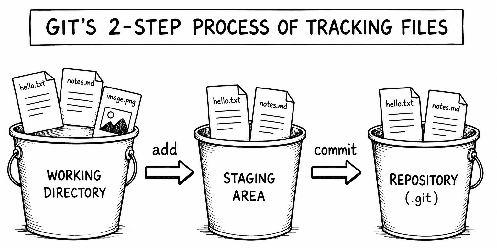
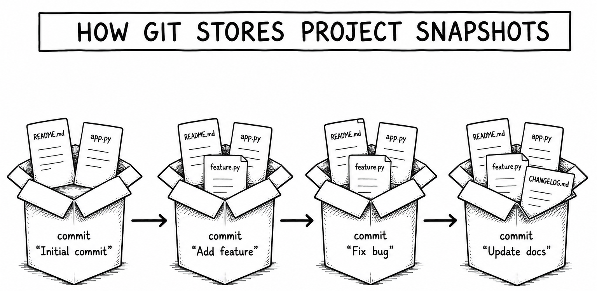
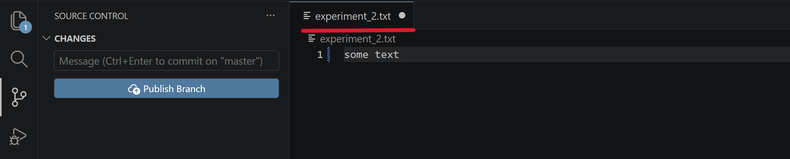
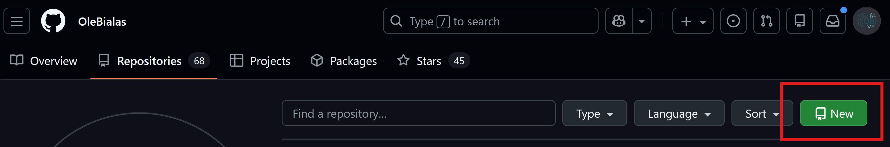
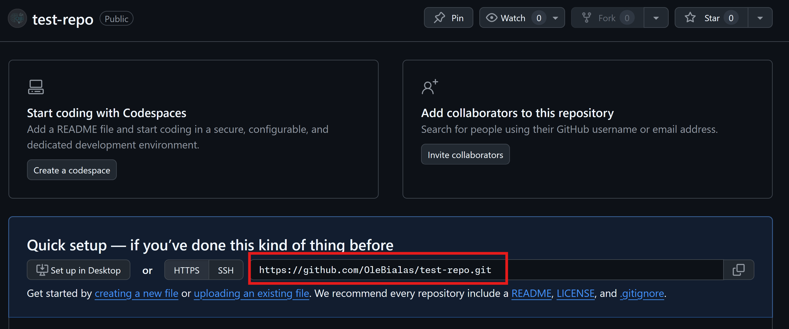
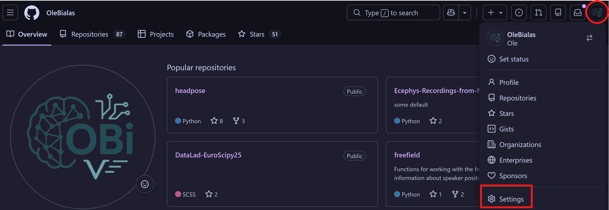
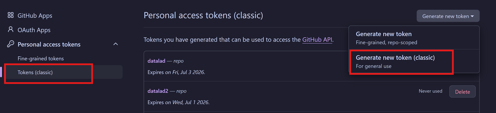
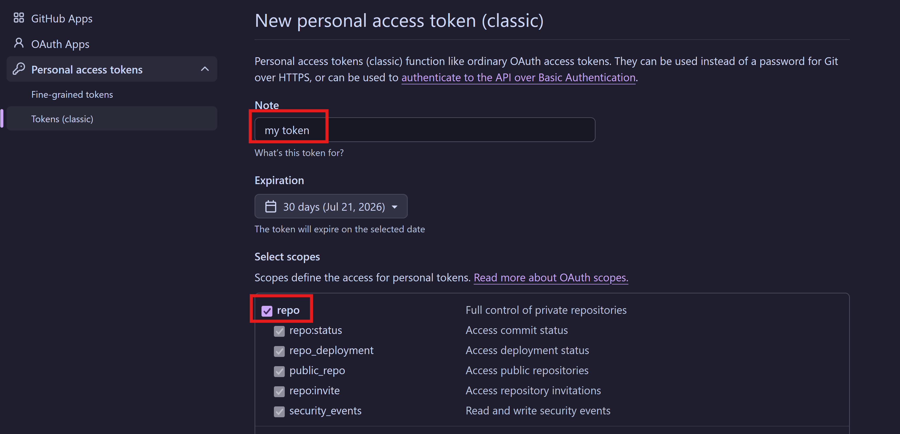
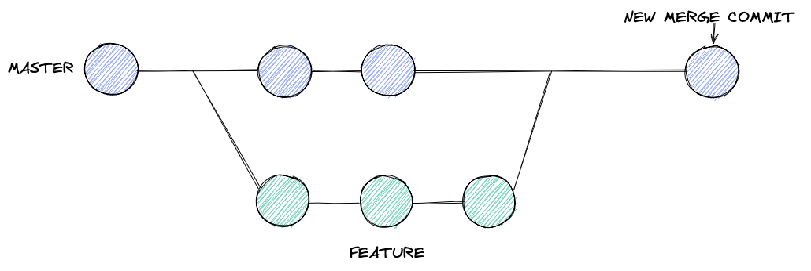
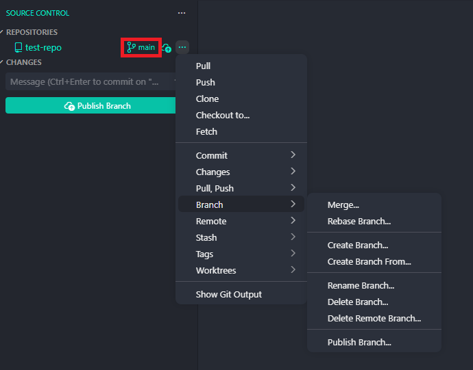

# Version Control with Git

[](https://colab.research.google.com/drive/1ym5mSBaIiGsMvFluye4O2cU7YXuLJfFo?usp=sharing)

Writing code is often not a linear process, involving exploration, tinkering, and trial-and-error. Without the right tools, this can result in a messy codebase with multiple, slightly modified versions of the same code, making it hard to understand, maintain and reproduce the project. Version control systems provide a solution for this: They record snapshots of your project at different points in time, which allows you to see what changed and why and to revert to previous versions of your code if needed.

Git is a distributed version control system and it is by far the most popular one with an adoption rate of [over 90%](https://rhodecode.com/blog/156/version-control-systems-popularity-in-2025) in the software industry.  In this lesson, you'll learn the basics of Git:
 how to track changes, view the project's history and restore old versions.

The materials feature two different ways of using Git: the terminal and VS Code's graphical user interface (GUI). It is recommended that you test out both methods because they each have their distinct advantages: The GUI provides a convenient interface that makes it easier to integrate Git into your workflow while the terminal allows you to use more advanced functionalities of Git that are not implemented in the GUI.

If you haven't installed Git already, go to the [website](https://git-scm.com/downloads), download the installer for your operating system and follow the instructions (there are a lot of options in the installation - you can accept the defaults).
Then run the following commands in your terminal (replacing the text in quotations with your actual name and email address) so Git can associate your commits with your identity.

```bash
git config --global user.name "Your Name"
git config --global user.email "your.email@example.com"
```


## Tracking Files with Git

### Background

With Git, you create regular snapshots of your project files and save them in the version control system. This is a two-step process: first, you `add` files from your working directory to the **staging area**, then you `commit` all changes in the staging area to the **repository** where they are stored permanently.



The two-step process allows you to define exactly what goes into every snapshot. In a typical workflow, you *stage* any change you make to the files in the temporary staging area and once you are happy with the changes you have made, you *commit* them. The points where you *stage* and *commit* are up to you. Ideally, every snapshot reflects one unit of work, such as adding data, editing a script or creating a figure, and has a message that identifies the purpose of the commit. This gives you a history that is easy to read, understand, and undo if required.



Note that Git can only see your changes once they have been saved. In VS Code, if you have made a change to a file but haven't saved it yet, there will be a white dot next to the filename in the tab in the editor (see red line in the screenshot below). For Git to detect the change, you need to save by pressing Ctrl + S (or Cmd + S on a Mac keyboard) or enable "Auto Save" via the "File" menu in the top left corner of VS Code.



### Exercises

In this section, you are going to create your first `git` repository, add files to it and track their changes. Below is a table with the required commands that can be run in the terminal. There are also instructions for the same operations in the graphical interface of VS Code (other editors have similar interfaces). You can switch between both approaches as you like.

| Code                | Description                                             | VS Code GUI |
|---|---|---|
| `git init`            | Initialize a new Git repository in the current directory | Click **Source Control (Ctrl + Shift + G)** → Click **"Initialize Repository"** |
| `git status`          | Show the status of changes in the working directory      | Click **Source Control (Ctrl + Shift + G)** → See the file changes |
| `git add file1.txt`   | Stage `file1.txt` for commit                             | Click **➕ (plus) icon** next to the file in **Source Control** |
| `git add .`          | Stage all modified and new files                         | Click **➕ (plus) icon** next to each file OR Click **"Stage All Changes"** |
| `git commit -m "<message>"` | Commit staged files with a message | Click **✔ (checkmark) icon**, enter commit message, and press Enter |
| `git commit -am "<message>"` | Stage and commit all modified files in one step | Click **"Stage All Changes"**, then **✔ (checkmark) icon** |

First, create a new, empty folder and open it in VS Code or do it in the terminal:


```python
mkdir /tmp/new_repo # create directory
cd /tmp/new_repo # change working directory
```

    /tmp/new_repo


**Exercise**: Initialize a new Git repository in this folder.


```python

```

**Exercise**: Check the status of the repository - there should be nothing to commit yet.


```python

```

**Example**: Create a new file called `experiment_1.txt` with any content and add it to the staging area.


```python
# after creating experiment_1.txt:
git add experiment_1.txt
```

**Exercise**: Create `experiment_2.txt` and `experiment_3.txt` and stage both files.


```python

```

**Exercise**: Commit the staged changes and add a message like `"Add data from experiments"`.


```python

```

Make a change to `experiment_1.txt` and check the status - it should show you a modified file.


```python

```

**Exercise**: Add and commit the change (**Hint**: in the terminal, you can use `commit -am` to add and commit in one go.). Check the status to confirm there are no untracked changes.


```python
#After modifying experiment_1.txt:
git commit -am "Add data to experiment 1"
git status
```

**Exercise**: Make changes to `experiment_2.txt` and `experiment_3.txt` and save them in a single commit. Check the status whenever you need to.


```python
#After modifying experiment_2.txt and experiment_3.txt:
git status
git add .
git status
git commit -m "New data for experiments 2 & 3"
git status
```

**Exercise**: Delete `experiment_3.txt`, check the status and commit the change.


```python

```

## Pushing a Local Repository to GitHub

### Background

To push your local repository to GitHub, you can create a new empty repository on GitHub and add it as a remote. A remote is simply a URL that points to an online repository that Git can track. We can give the remote any name but typically it is called `origin` because it is the "source of truth" that reflects the current state of the project where others copy from. To push to the registered remote we have to set it as upstream to mark it as a target to push to. Setting the upstream requires two inputs the remote repository (i.e. `origin`) and the branch we want to push. If you haven't created any branches there is only a single one and it is called either `main` (newer name) or `master` (older name).
Once the upstream is registered we can use `git push` to push local changes to the remote repository. You can also register the upstream and push in a single command

### Exercises

In the following exercises you are going to create a new repository on GitHub, add it as a remote to you local repository and push it to the remote. You can use any existing Git repository on your machine or create one from scratch (you'll need at least one file so there is something to push). Here are the commands you'll need to know:

| Code                           | Description                                              | VS Code GUI |
|-----------------------------------|----------------------------------------------------------|-------------|
| `git remote add origin <URL>`     | Link the local repository to a remote GitHub repository | Click **Source Control (Ctrl + Shift + G)** → Click **Publish Repository** |
| `git push -u origin main`         | Push local commits to the remote repository and set upstream | Click **Source Control** → Click **...** → Click **Push** |
| `git push`         | Push local commits to the remote repository (once upstream is set) | Click **Source Control** → Click **...** → Click **Push** |
| `git pull`         | Push local commits to the remote repository (once upstream is set) | Click **Source Control** → **Synchronize Changes** (the two arrows that form a circle) |


**Exercise**: Create a new **public** repository on GitHub (**without** initializing it with README. It should be **completely** empty) and copy the clone URL. 






**Exercise**: In your local repository, add the remote URL using `git remote add origin <repo-url>`.


```python

```

**Exercise**: Push the local repository to GitHub using `git push -u origin main` or `git push -u origin master` and authenticate yourself when you are prompted. Then, open the repository in the browser to verify the content was pushed.

**Note**: When Git asks you for a password, do not use your GitHub password but an **Access Token** instead. Generate the token following these steps:

1. Go to **Settings**


2. Go to **Developer Settings** at the bottom of the left side menu

3. Generate a **new (classic) token**


4. Create a token with the **repo** access right



```python

```

**Exercise**: Add a new text file with some content and commit the changes to the repository. Then, `git push` the changes to the remote and check the GitHub repository in the browser to verify the file was transferred.


```python

```

**Exercise**: Add a new line to the file, commit the changes and `git push` to the remote again. Then, check the GitHub repository in the browser to verify the file was transferred.


```python

```

**Exercise**: Now edit one of the textfiles on GitHub in the browser and commit the changes there. Then, run `git pull` to update the local repository and verify the edits where copied.


```python

```

## Inspecting the Commit History

### Background
Commits are saved in order, creating a history of changes in the project. You can see past commits using `git log` or in the "Graph" panel of VS Code's "Source Control" interface. Each entry contains a unique identifier (hash), a message as well as the time and author of the commit so you know who did what when.

The commit history also allows us to compare specific commits with `git diff`. The `diff` algorithm compares two files line-by-line to tell us exactly what has changed. We can select commits for `git diff` in two ways: either by using the **commit hash** or by the position of the commit relative to the most recent commit called `HEAD` (for example, `HEAD~1` refers to the second most recent commit). Note that the commit hashes are **unique** for every repository so the ones you'll see in the exercises and solutions in this notebook will not match the ones you'll see on your machine.

### Exercises

In this section, you'll start by inspecting the commit history of your project. You'll then use `diff` and compare specific commits to see what has changed. Some of these operations can be executed via the terminal and VS Code's graphical interface while others are terminal only.

| Code | Description | VS Code GUI |
|---------|-------------|-------------|
| `git log` | View the full commit history of the repository | Expand the **Graph** in **Source Control** |
| `git log --oneline` | View a compact version of the commit history | **N/A** (terminal only) |
| `git log -2` | Display the last two commits | **N/A** (terminal only) |
| `git diff a1b2c3d` | Compare the working directory to the commit with the hash `a1b2c3d` | Click on the file in **Source Control** and check the inline diff |
| `git diff HEAD~1` | Compare the working directory to the second most recent commit | Click on the file in **Source Control** and check the inline diff |
| `git diff HEAD~3 HEAD~2` | Compare the third and second most recent commits | **N/A** (terminal only) |
| `git diff <commit1> <commit2>` | Compare two specific commits (the older commit goes first) | **N/A** (terminal only) |


**Exercise**: View the full commit history of the repository.


```python

```

**Exercise**: Check your commit history, find the second most recent commit and copy its hash.


```python

```

**Exercise**: Use the hash from the previous exercise to compare the commit to the working directory.


```python

```

    diff --git a/experiment_3.txt b/experiment_3.txt
    deleted file mode 100644
    index 6e1ddff..0000000
    --- a/experiment_3.txt
    +++ /dev/null
    @@ -1,2 +0,0 @@
    -This is the 3rd experiment
    -There are 4 conditions


**Exercise**: Compare the same commit to the working directory using `HEAD~1`.


```python

```

    diff --git a/experiment_3.txt b/experiment_3.txt
    deleted file mode 100644
    index 6e1ddff..0000000
    --- a/experiment_3.txt
    +++ /dev/null
    @@ -1,2 +0,0 @@
    -This is the 3rd experiment
    -There are 4 conditions


**Exercise**: Compare the differences between the third-most-recent commit and the working directory using `HEAD` or the hash.


```python

```

**Exercise**: Compare two specific commits.


```python

```

## Reverting and Undoing Changes

### Background

Because Git keeps the full history of all files, it allows you to go back to a previous version of your work if needed. You can run `git checkout <commit>` to set your repository to the exact state of that commit. This puts you in a "detached HEAD" state - this may sound scary but it simply means Git is no longer remembering new commits as part of your normal project history. This means that the detached HEAD state is useful for inspecting and experimenting with old commits but not for committing new work. To return to the latest commit on your default branch, use `git checkout main` or `git checkout master`, depending on the branch name in your repository.

You can also restore older commits permanently by using `git reset`. There are different reset modes: `--soft` and `--hard`. With a soft reset, you are keeping all modifications that happened after the reset point as staged changes in your working directory. With a hard reset, you immediately lose all modifications after the reset point which makes the operation dangerous. Resets can also be problematic in shared repositories because rewriting the git history can cause problems for your collaborators.

Another way of restoring older commits is `git revert`. Instead of removing changes, revert creates a new commit that undoes the changes made by the given commit. This is safer because it keeps the commit history intact. The downside is that reverts may cause merge conflicts. If you are trying to undo a line that has been modified again in later commits, Git does not know what to do. Should it undo the requested commit as well as the later one or keep the later one and ignore the revert? In these cases, Git will warn you about a merge conflict which means that you have to select manually what to keep and what to drop.

### Exercises

In this section, you'll start by using `git checkout` to inspect older versions of your repository and then use `git reset` and `git revert` to restore those older versions.
Because most of these operations are not exposed by VS Code's graphical interface, you'll have to use the terminal. Here are the relevant commands:

| Command | Description |
| --- | --- |
| `git checkout HEAD~1` | "Rewind one step": Update the working directory to match the second latest commit. |
| `git checkout <commit>` | "Jump to a specific commit": Update the working directory to match the given `<commit>`. |
| `git checkout main` | Return to the latest commit on the `main` branch. Use `master` instead if that is your default branch name. |
| `git reset --soft <commit>` | Rewind the history to commit hash `<commit>`, keeping all changes after in the staging area (**dangerous** in shared repos). |
| `git reset --hard <commit> ` | Rewind the history to commit hash `<commit>`, dumping all commits made afterward (**dangerous** in shared repos) |
| `git revert <commit>` | Make a new commit to undo the given `<commit>` (**great** in shared repos). |

**Exercise**: Check the last entry in your commit history, then use `git checkout HEAD~1` to update the working directory to the second latest commit and check the commit history again.


```python

```

**Exercise**: Use `git checkout main` (or `git checkout master`) to move the working directory back to the most recent commit on your default branch and check the commit history.


```python

```

**Exercise**: Check the commit history, pick a commit from the past and `checkout` to that commit. Explore the files to see how the repository looked at that time. When you are done, checkout to the most recent commit on your default branch again.


```python

```

**Exercise**: Undo the latest commit using `git revert HEAD`. This may open the text editor VIM to edit your commit message. To exit VIM, press Esc, type `:wq` (w for write, q for quit) and hit Enter.


```python

```

**Exercise**: Check the commit history to view the entry made by `revert`. Then run `git revert HEAD` again to undo the undoing of the previous commit.


```python

```

**Exercise**: Check the commit history to view the entry made by `revert`. Then run `git revert HEAD` again to undo the undoing of the previous commit and check the history again.


```python

```

**Exercise**: Pick a commit from the past and use `git reset --soft` to reset the repository to that state. Then, check `git status` - you should see the modifications that happened after the reset point as staged changes. Commit the staged changes again.


```python

```

**Exercise**: Pick a commit from the past and use `git reset --hard` to reset the repository to that state. Then, check `git status` - you should not see any changes because the modifications after the reset point have been dropped.


```python

```

## BONUS: Ignoring Files

### Background

By default, Git tracks every file in the directory. However, some files and folders should not be tracked. For example, Git is not intended to be used for large files, so you should not let Git track your neural recordings. To prevent Git from tracking specific files, we can create a file called `.gitignore` and add the to-be-ignored files. `.gitignore` is simply a text file where you can either list individual files or patterns such as `*.pdf` or `subject*`, which mean "ignore every file/folder ending with `.pdf` or starting with `subject`". There are also [.gitignore generators](https://www.toptal.com/developers/gitignore) that provide ready-made templates with files and patterns that are commonly ignored for a given language.

Importantly, adding a file to `.gitignore` that is already tracked by Git will not automatically make Git drop it. To do this, you need to call `git rm --cached <file>` which will remove it from Git's index but keep it as a file in your working directory. While Git will ignore changes in this file going forward, it will not remove it from the commit history so it can still be restored later.
Note that editing `.gitignore` and running `git rm --cached` are changes that need to be committed to be effective.

### Exercises

In the following exercises you will create a `.gitignore` file, add files to ignore and observe how this affects Git's behavior. Here are the commands you need to know:


| Code | Description | VS Code GUI |
|---------|-------------|-------------|
| `git status`          | Show the status of changes in the working directory      | Click **Source Control (Ctrl + Shift + G)** → See the file changes |
| `git add f1.txt f2.txt` | Stage specific files for commit | Click **➕ (plus) icon** next to the files in **Source Control** |
| `git add .` | Stage modifications of all files | Click **➕ (plus) icon** next **Changes** |
| `git commit -m "Commit message"` | Commit staged files with a message | Click **✔ (checkmark) icon**, enter commit message, and press Enter |
| `git commit -am "Commit message"` | Stage and commit all modified files in one step | Click **"Stage All Changes"**, then **✔ (checkmark) icon** |
| `git rm --cached <file>`  | Remove the file from Git's index | **N/A** (command line only) |

**Exercise**: Create the `.gitignore` file in your folder and add `experiment_4.txt` to it. Then stage and commit the file.


```python

```

**Exercise**: Create `experiment_4.txt` and check `git status`. You should not see any untracked changes because the file should be ignored.


```python

```

**Exercise**: Add `*.txt` to `.gitignore` to ignore all text files and commit.


```python

```

**Example**: Use `git rm --cached` to remove `experiment_1.txt` from Git's index but keep it in your working directory and commit.


```python

```

**Exercise**: Use `git rm --cached` to remove `experiment_2.txt` from Git's index but keep it in your working directory and commit.


```python

```

**Exercise**: Modify `experiment_2.txt` and check `git status` - it should not show any changes.


```python

```

## Bonus: Working with Branches

### Background

When experimenting with code, we usually want to avoid breaking the project. Git branches are great for this - they allow you to create a separate copy of your repository that can be modified without affecting anything else. When a repository is initialized, Git creates a single default branch called `main` (or `master` in older versions) but you can create additional branches using the `git branch` command. The working directory always shows the currently selected branch which is shown in the VS Code GUI next to the repository name or when you call `git status`. When you switch branches with `git checkout` your working directory will change to the new branch.

If you made commits to a new branch that you want to incorporate into your main branch you can merge the branches. This is a typical workflow for collaborative coding: everyone creates their own branch off the default branch, makes their commits and then (after review) merges them back.



Git creates a new commit for every merge that contains the entire commit history of the merged branch. A useful variant is `git merge --squash` which treats all commits in the merged branch as a single commit. This is nice when you experimented on a side branch, made a bunch of commits and want to avoid cluttering the git history with them.

### Exercises

In this bonus section you are going to create new branches in your repository, edit those branches and then merge them into main or master. You can do this via the terminal or using the branch menu in VS Code's graphical interface (see screenshot below).



If you are working in the terminal and merge a branch without adding a message with `-m` the terminal may open the editor Vim where you can edit the default message.
To exit Vim press Esc, type `:wq` (write + quit) and hit enter.

| Command | Description | VS Code GUI |
| --- | --- | --- |
| `git branch` | List the branches in the repo (active one has a star by it) | **Source Control** -> click on the current branch |
| `git branch <name>` | Make a new branch from the current commit, named `<name>` | **Branches** -> **Create Branch ...** (VS Code immediately switches to the new branch)|
| `git branch -d <name>` | Delete the branch `<name>` and all the commits with it. | **Branches** -> **Delete Branch ...** |
| `git branch -D <name>` | Delete the branch `<name>` and all the commits with it, *even if they aren't merged somewhere else already*. | **Branches** -> **Delete Branch ...** and confirm 
| `git checkout <name>` | Switch the working directory to the specified branch. | **Source Control** -> click on the current branch -> select another one |
| `git merge <name>` | Merge the commits from the branch `<name>` into the current branch. | **Branches** -> **Merge ...** |
| `git merge --squash <name>` | Stage the combined changes from the branch `<name>` as one commit in the current branch. | **N/A** (terminal only) |


**Exercise**: Create a tracked Markdown file called `notes.md` that you can modify on different branches.


```python

```

**Exercise**: Create a new branch called `feature1` and switch to that branch. Confirm you are on `feature1` by checking `git status` or the **Source Control** panel in VS Code.


```python

```

**Exercise**: Make **at least** two commits to `feature1`.


```python

```

**Exercise**: Switch back to `main` (might also be called `master`) and merge `feature1`. Check the commit history to confirm your default branch contains the commits from `feature1`.


```python

```

**Exercise**: Delete the branch `feature1`.


```python

```

**Exercise**: Switch to a new branch `feature2` and make **at least** two commits to that branch.


```python

```

**Exercise**: Switch back to `main` (or `master`) and merge `feature2` with `--squash`. Then, check the commit history - you should only see a single commit for the merge.


```python

```
